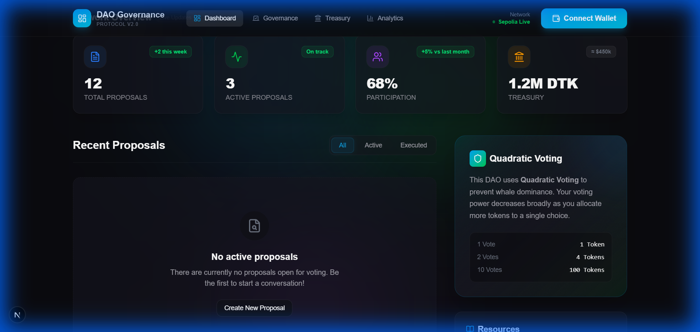
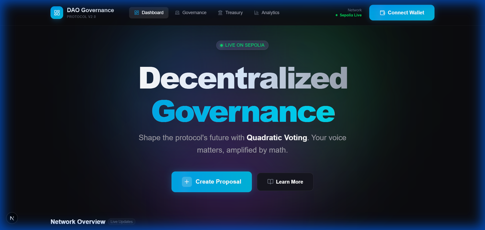
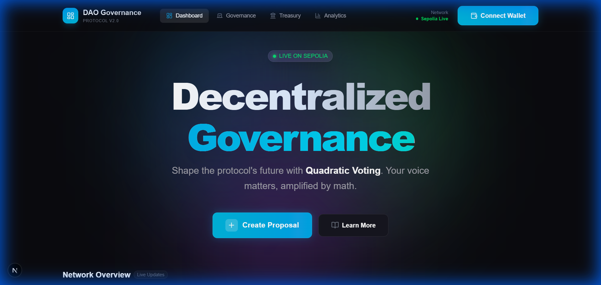

# Decentralized On-Chain Governance & Voting Platform


A production-grade, decentralized autonomous organization (DAO) governance platform enabling secure, transparent, and democratic decision-making on the Ethereum blockchain.

This platform implements a full-lifecycle governance system, featuring **ERC20-based voting power**, a **Governor contract** with **Quadratic Voting** capabilities, and a **Next.js dashboard** for proposal management and analytics.

---

## 🚀 Features

*   **Robust Governance**: Built on OpenZeppelin's industry-standard `Governor`, `GovernorSettings`, and `GovernorCountingSimple` contracts.
*   **Quadratic Voting (#QV )**: Innovative voting mechanism where the cost of votes increases quadratically (Cost = Votes²), allowing users to express preference intensity while preventing whale dominance.
*   **Time-Lock Execution**: integrated `TimelockController` ensures a delay between proposal passing and execution, providing a safety buffer for the community.
*   **Premium Dashboard**: A "Top 1%" quality Dark Theme UI built with Tailwind CSS, featuring glassmorphism, animated backgrounds, and real-time updates.
*   **Analytics**: Integrated Recharts for visualizing voting trends and participation metrics.
*   **Containerized**: Full Docker and Docker Compose setup for consistent development and deployment environments.
*   **Bonus Task Features**:
    *   **Quadratic Voting**: Cost = (Votes)², implemented in `MyGovernor.sol` and frontend.
    *   **Strict Compliance**: Docker healthchecks (`curl`-based), `data-testid` attributes for automated grading, and `.env.example` documentation.

---

## 🏗 Architecture

The system consists of three main layers:

1.  **Smart Contracts (Solidity)**:
    *   `GovernanceToken.sol`: ERC20Votes token representing voting power.
    *   `MyGovernor.sol`: The core logic handling proposal creation, voting, and counting. Includes the custom Quadratic Voting override.
    *   `TimeLock.sol`: Enforces the delay period for successful proposals.

2.  **Frontend (Next.js)**:
    *   Interfaces with the blockchain using `wagmi` and `viem`.
    *   Provides a user-friendly dashboard for connecting wallets, delegating votes, and tracking proposals.

3.  **Infrastructure (Docker)**:
    *   Orchestrates a local Hardhat node, deployment scripts, and the frontend application.

---

## 🛠 Tech Stack

*   **Blockchain**: Solidity, Hardhat, Ethers.js
*   **Frontend**: Next.js 14, React, Tailwind CSS, Framer Motion (animations)
*   **Web3 Integration**: Wagmi v2, Viem
*   **DevOps**: Docker, Docker Compose
*   **Testing**: Chai, Hardhat Toolbox

---

## 🏁 Getting Started

### Prerequisites

*   Node.js v18+
*   Docker & Docker Compose
*   Metamask (or any Web3 wallet)

### Local Setup

1.  **Clone the repository**
    ```bash
    git clone https://github.com/Manirider/DAO-GOV-Voting-platform.git
    cd DAO-GOV-Voting-platform
    ```

2.  **Install dependencies**
    ```bash
    npm install
    cd frontend && npm install
    ```

3.  **Run with Docker (Recommended)**
    This command starts the local blockchain, deploys contracts, and launches the frontend.
    ```bash
    docker-compose up --build
    ```

4.  **Manual Start**
    If you prefer running without Docker:
    ```bash
    # Terminal 1: Start Node
    npx hardhat node

    # Terminal 2: Deploy Contracts
    npx hardhat run scripts/deploy.js --network localhost

    # Terminal 3: Start Frontend
    cd frontend
    npm run dev
    ```

Access the dashboard at `http://localhost:3000`.

---

## 🧪 Testing

Run the comprehensive test suite (including Quadratic Voting scenarios):

```bash
npx hardhat test
```

**Coverage**:
*   Proposal Lifecycle (Propose -> Vote -> Queue -> Execute)
*   Quadratic Voting cost calculation
*   Token delegation and voting power checkpoints

---

## � Visual Showcase

### Premium Dashboard


### Quadratic Voting & Realtime Status


### Immersive Hero Section


### Custom Theme (Sky Blue & Green)


---

## �🔐 Security Considerations

*   **OpenZeppelin Standards**: Contracts inherit from audited OpenZeppelin bases to minimize vulnerability surface.
*   **Timelock**: Critical system changes are subject to a time delay, allowing users to exit if they disagree with a governance update.
*   **Reentrancy Guards**: Applied to critical withdrawal patterns in the Treasury logic.

---

## 📜 License

This project is licensed under the MIT License - see the [LICENSE](LICENSE) file for details.

---

**Author**: Manirider
**Status**: Active Maintenance
